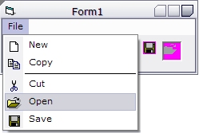



## Office menus

### Description

Owner draws Office-looking menus. I took most of the owner drawing code from www.vbthunder.com, but i edited a lot of it to make it look like this. So you shouldn't really vote, i'm just sharing. =). office menus.

EDIT: I added seperators.

i don't know why the screenshot doesn't show, so click here to view it: http://www.planetsourcecode.com/upload/ScreenShots/PIC2002105048323678.jpg
 
### More Info
 

             |
---                |---
**Submitted On**   |2002-10-02 17:52:40
**By**             |[Alex Kwok](https://github.com/Planet-Source-Code/PSCIndex/blob/master/ByAuthor/alex-kwok.md)
**Level**          |Intermediate
**User Rating**    |4.8 (43 globes from 9 users)
**Compatibility**  |VB 5\.0, VB 6\.0
**Category**       |[Custom Controls/ Forms/  Menus](https://github.com/Planet-Source-Code/PSCIndex/blob/master/ByCategory/custom-controls-forms-menus__1-4.md)
**World**          |[Visual Basic](https://github.com/Planet-Source-Code/PSCIndex/blob/master/ByWorld/visual-basic.md)
**Archive File**   |[Office\_men1398691022002\.zip](https://github.com/Planet-Source-Code/alex-kwok-office-menus__1-39436/archive/master.zip)

